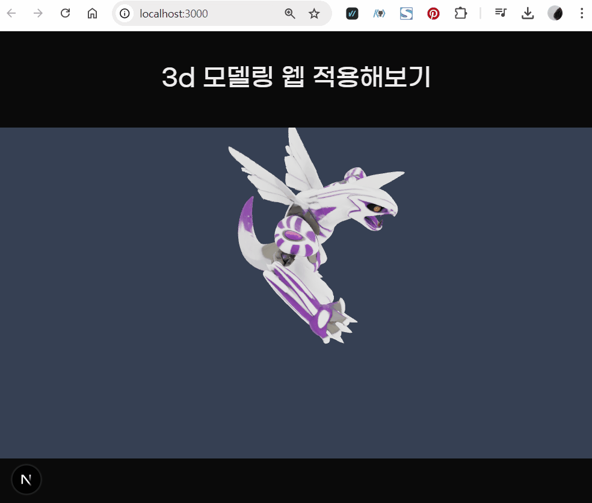
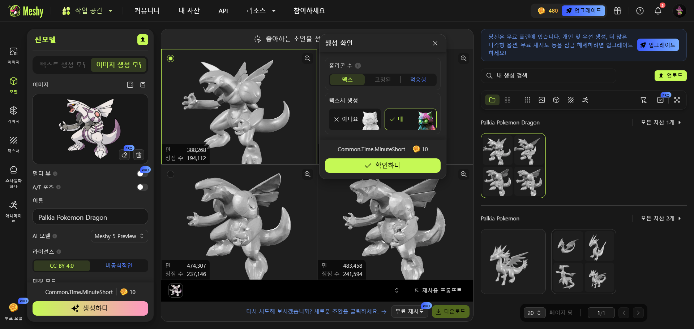
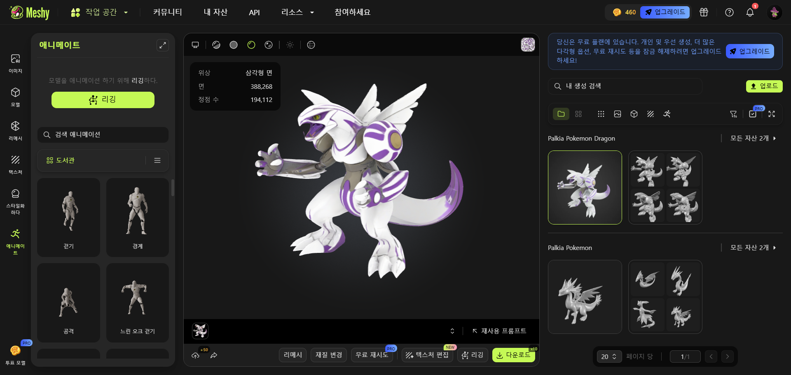
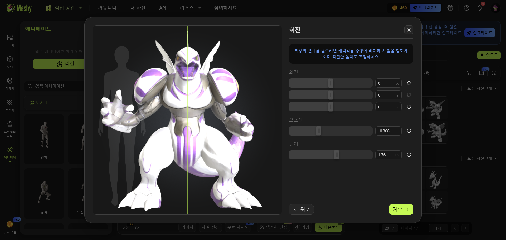
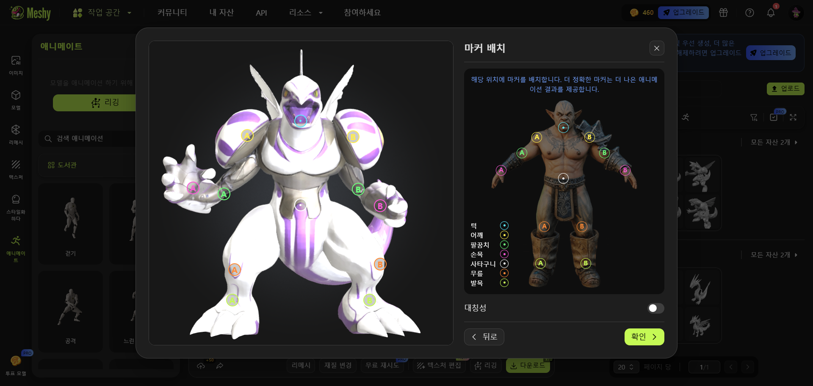

# AI-3D-Modeling

### 개발 환경

+ **이미지 생성**: ChatGPT
+ **3D 모델링**: meshy.ai
+ **프레임워크**: Next.js
+ **3D 라이브러리**:
  + "three": "^0.178.0"
  + "@react-three/drei": "^10.6.1"
  + "@react-three/fiber": "^9.3.0"

### 펄기아 3D 모델링 결과

### meshy.ai 모델링 과정

